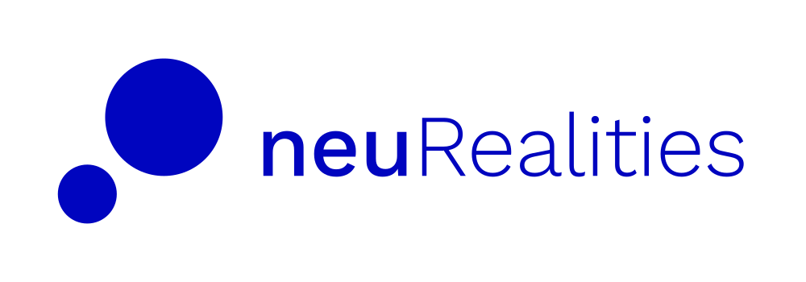

# Tavus Examples

Welcome to our collection of demos and projects showcasing the Tavus conversational video interface! 🚀

## 🌟 What's Inside?

This repository is packed with resources that demonstrate how you can build immersive AI-generated video experiences in your application:

- 🤖 Build authentic digital twin experiences
- 💡 Create advanced use cases for conversational video interfaces

<!-- neuREalities Additions -->

- [CVI UI Haircheck and Conversation](./examples/cvi-ui-haircheck-conversation) has been updated to include text, image, and favicon branding.
- Next step: Use [persona layering documentation](https://docs.tavus.io/sections/conversational-video-interface/persona/llm) for adding custom LLM to response. 
- [Tavus Santa Demo](./showcase/santa-demo) UI has been modified to include some neuREalities branding and reduce festivities load theme. 

## 💻 Examples

- [CVI Quickstart React](./examples/cvi-quickstart-react)
- [CVI Transparent Background](./examples/cvi-transparent-background)
- [Replica Recording](./examples/replica-recording)
- [CVI UI Conversation](./examples/cvi-ui-conversation)
- [CVI UI Haircheck and Conversation](./examples/cvi-ui-haircheck-conversation)

## 🎄 Showcases

- [Tavus Santa Demo](./showcase/santa-demo)

## 📚 Learn More

Ready to dive deeper? Check out these resources:

- 📖 [Developer Documentation](https://docs.tavus.io/)
- 🔧 [API Reference](https://docs.tavus.io/api-reference/)
- 🚀 [Tavus Platform](https://platform.tavus.io/)

Start exploring and happy coding! 🎉

## 📄 License

This project is licensed under the Apache License 2.0 - see the [LICENSE](LICENSE) file for details.
